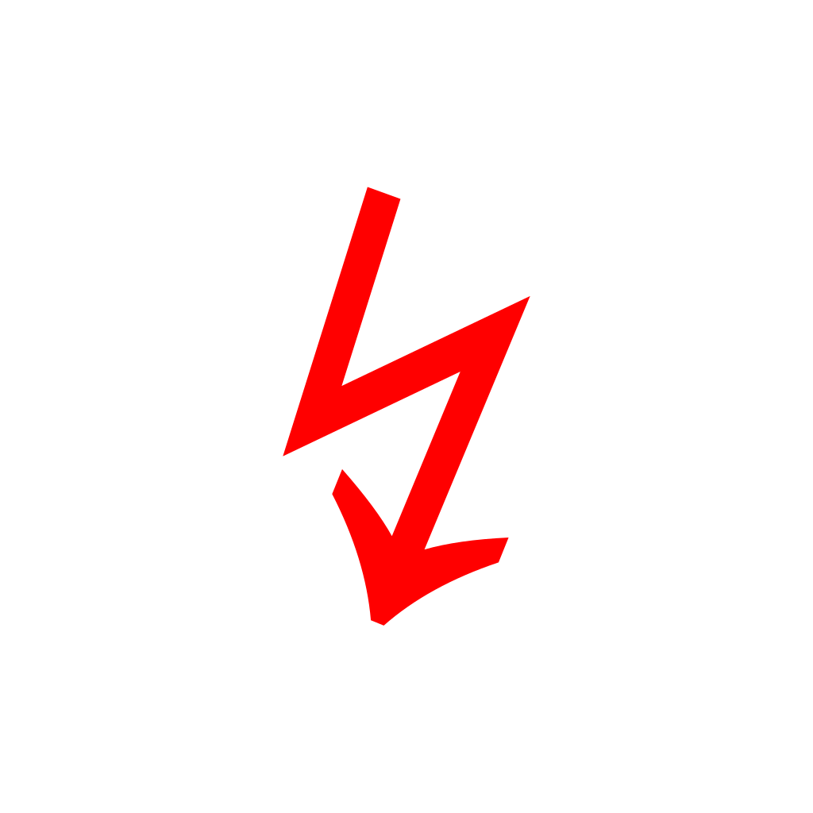

UniSVG: Unicode Glyph to SVG Converter

A powerful Python tool that converts Unicode characters to clean, centered SVG paths using professional fonts.

✨ Features

# UniSVG: Unicode Glyph to SVG Converter


A powerful Python tool that converts Unicode characters to clean, centered SVG paths using professional fonts. Perfect for creating resolution-independent symbols, mathematical typesetting, and icon systems.

## 🎯 Quick Example

Here's what ⨳ (U+2A33) looks like converted with NotoSansMath:


```bash
# Convert ⨳ to SVG in one command
python unisvg.py ⨳ -o smash_noto.svg
```

✨ Features

· Multiple Font Support: Choose between historical Symbola, modern NotoSansMath, or general NotoSans
· Automatic Font Selection: Intelligently picks the best font for each character
· Perfect Centering: Mathematically precise centering within any viewBox
· Clean SVG Output: Pure path data without font rendering artifacts
· Batch Processing: Convert multiple characters at once
· Comparison Tools: See how characters render in different fonts

🚀 Quick Start

```bash
# Clone the repository
git clone https://github.com/yusdesign/unisvg.git
cd unisvg

# Install dependencies
pip install fonttools

# Download all fonts
python unisvg.py --download-all

# Convert your first symbol
python unisvg.py ⨳ -o symbol.svg
```

📦 Font Choices

Font Best For Style Example
notomath Mathematical symbols Modern, clean 
symbola Historical symbols Broad Unicode 
notosans General text Sans-serif 

🎯 Usage Examples

Basic Conversion

```bash
# Convert any Unicode character
python unisvg.py ★ -o star.svg
python unisvg.py ♥ -o heart.svg
python unisvg.py ∞ -o infinity.svg
```

Advanced Options

```bash
# Auto-select best font
python unisvg.py ⨳ --auto -o symbol.svg

# Custom size and color
python unisvg.py ↯ -s 500 -c "#ff0000" -o fire.svg

# Path-only output (for embedding)
python unisvg.py ⊕ --path-only

# Batch convert symbols
python unisvg.py "⨳★↯⊕⊗∞∫∑∏√" --batch symbols/
```

🔍 Inspection & Comparison

```bash
# Check character support across all fonts
python unisvg.py --check ⨳

# Compare rendering in different fonts
python unisvg.py --compare ★

# List available fonts
python unisvg.py --list-fonts

# Get font statistics
python unisvg.py --font-info notomath
```

🏗️ Use Cases

1. Icon Systems

Generate SVG icons from Unicode symbols for web/app development:

```bash
python unisvg.py "★♥♠♣♦" --batch icons/ --size 512
```

2. Mathematical Publishing

Convert equations to vector graphics for papers/presentations:

```bash
python unisvg.py "∑∏∫∂∇±×÷√∞≈≠≤≥" --batch math/ --font notomath
```

3. Web Development

Create resolution-independent symbols:

```html
<!-- Generated SVG can be embedded directly -->
<svg viewBox="0 0 1024 1024" width="32" height="32">
  <path d="M..." fill="currentColor"/>
</svg>
```

4. Design Assets

Export Unicode characters for design software:

```bash
# Create design system symbols
python unisvg.py "→←↑↓↔↕↻↺" --batch arrows/ --size 1024
```

📁 Project Structure

```
unisvg/
├── unisvg.py                 # Main converter script
├── fonts/                    # Font storage
│   ├── Symbola.ttf          # Historical Unicode font
│   ├── NotoSansMath-Regular.ttf  # Modern math symbols
│   └── NotoSans-Regular.ttf # General sans-serif
├── examples/                 # Example outputs
│   ├── smash_noto.svg       # ⨳ in NotoSansMath
│   ├── smash_symbola.svg    # ⨳ in Symbola
│   └── smash_notosans.svg   # ⨳ in NotoSans
├── requirements.txt          # Python dependencies
└── README.md                # This file
```

🔧 Installation

Requirements

· Python 3.7+
· fonttools library

Setup

```bash
# Install from PyPI (coming soon)
# pip install unisvg

# Or install dependencies manually
pip install fonttools
```

Font Management

Fonts are automatically downloaded on first use, or manually:

```bash
# Download all fonts
python unisvg.py --download-all

# Download specific font
python unisvg.py --download notomath
```

🧩 Technical Details

Output Specifications

· ViewBox: 1024×1024 (configurable)
· Glyph Size: 432 units by default (fits perfectly in viewBox)
· Centering: Mathematical precision to pixel grid
· Format: Pure SVG paths, no external dependencies

How It Works

1. Loads Unicode character from selected font
2. Extracts glyph outline as mathematical paths
3. Applies precise scaling and Y-axis flipping (fonts vs SVG)
4. Calculates exact centering within viewBox
5. Outputs clean SVG with transform matrix

📊 Performance

Operation Time Output Size
Single character ~0.1s 1-2 KB
Batch (10 chars) ~1s 10-20 KB
Batch (100 chars) ~10s 100-200 KB

🤝 Contributing

Contributions welcome! Here are some ideas:

1. Add More Fonts: Additional Unicode fonts
2. Web Interface: Flask/Django web app
3. CLI Improvements: More output formats
4. Performance: Optimize batch processing
5. Documentation: More examples and tutorials

Development Setup

```bash
git clone https://github.com/yusdesign/unisvg.git
cd unisvg
pip install -r requirements.txt
# Start developing!
```

📄 License

· Code: MIT License
· Fonts: Respective font licenses (SIL OFL, etc.)
· Symbols: Unicode Standard

🙏 Acknowledgments

· Unicode Consortium for character standards
· Google Fonts for Noto Sans family
· George Douros for Symbola font
· FontTools developers for Python library

📚 Resources

· Unicode Character Database
· Noto Fonts Project
· Symbola Font
· FontTools Documentation

---

Star this repo if you find it useful! ⭐

Created for designers and developers who need clean, scalable Unicode symbols without font rendering issues.


```bash
# Generate samples SVGs
python unisvg.py ⨳ --font notomath -o smash_noto.svg
python unisvg.py ⨳ --font symbola -o smash_symbola.svg
python unisvg.py ⨳ --font notosans -o smash_notosans.svg
```
